giffgaff 是英国的一家虚拟运营商，SIM 卡免月租、支持全球漫游，很多人拿它当接码 / 注册海外服务的长期号码。这份手册把从开卡到日常维护的所有操作按章节整理好了，照着做即可。

## 01 激活 SIM 卡 🚀

拿到实体卡后的第一件事，按以下 11 步完成开卡与首充。

**第一步**：访问 [giffgaff 官方激活页面](https://www.giffgaff.com/activate)，输入卡片上 6 位激活码，点击 **Activate your SIM**。

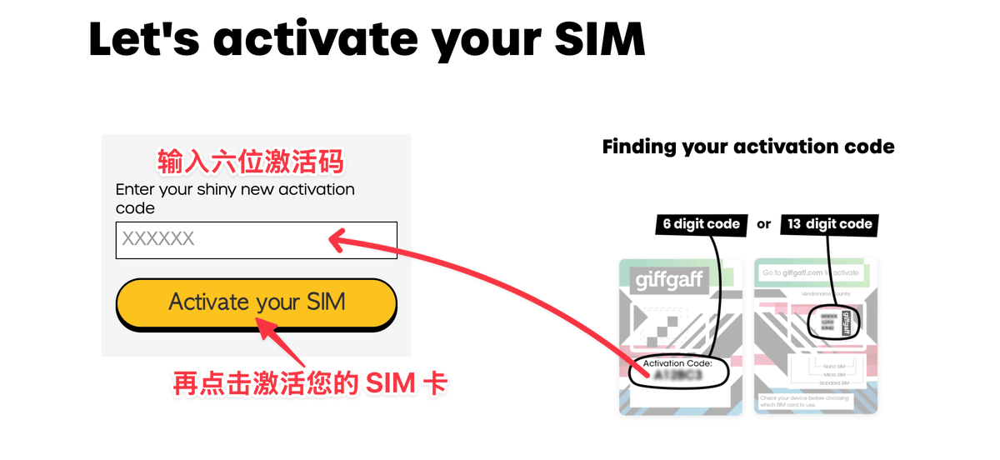

**第二步**：输入邮箱，点击 **Next**。

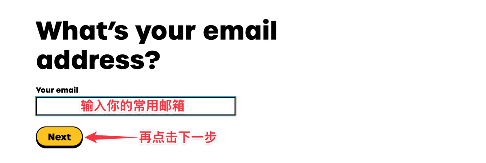

**第三步**：输入邮箱收到的验证码，点击 **Confirm**。

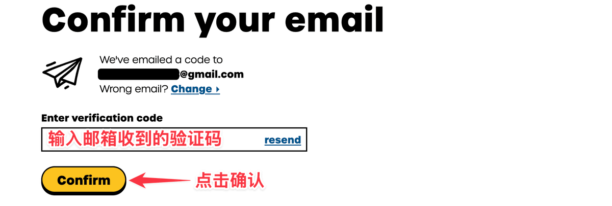

**第四步**：创建密码，点击 **Register**。

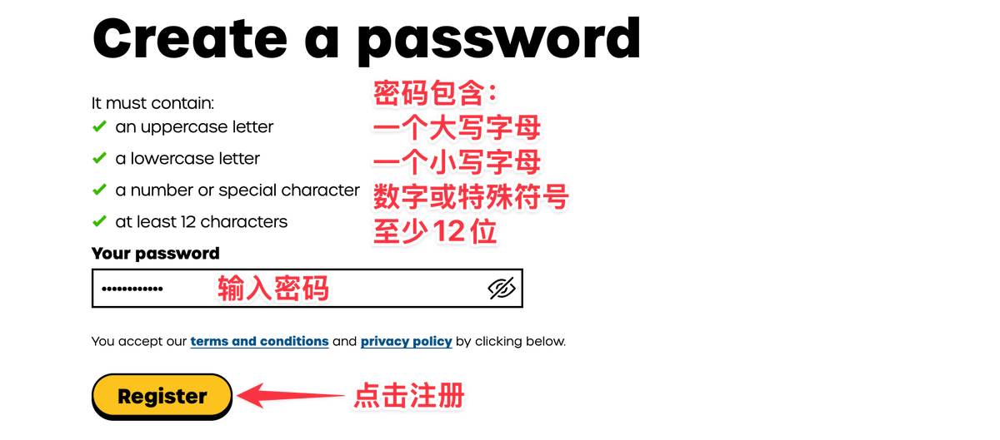

**第五步**：选择 **No, thanks**，点击 **Continue**。

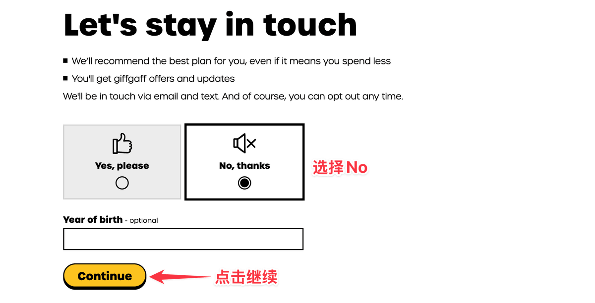

**第六步**：网页下拉至最底部选择 **Pay as you go**，点击 **Continue**。

:::note
注意别选错了套餐。
:::

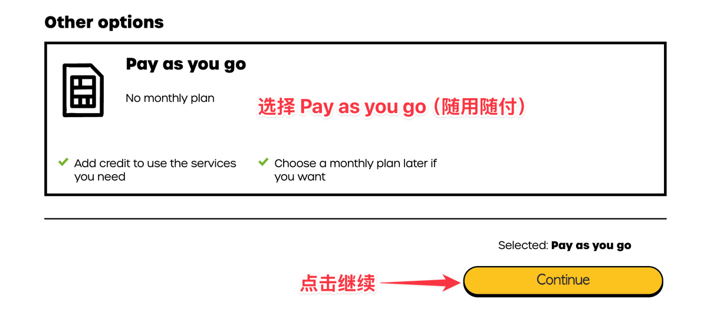

**第七步**：选择 10 英镑，点击 **Pay now**，使用多币种信用卡（VISA 或 MasterCard）进行充值。

:::tip
若没有信用卡，去找代充买充值卡，点击 **Or redeem a top-up voucher**，在 Voucher code 里输入 16 位充值卡密。
:::

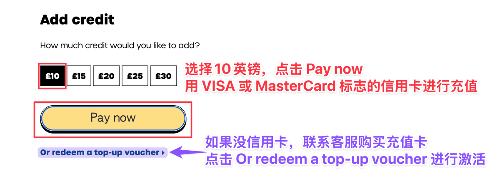

**第八步**：填写姓名和地址（建议用现实中存在的英文名，用谷歌地图搜个真实地址），点击 **Continue**。

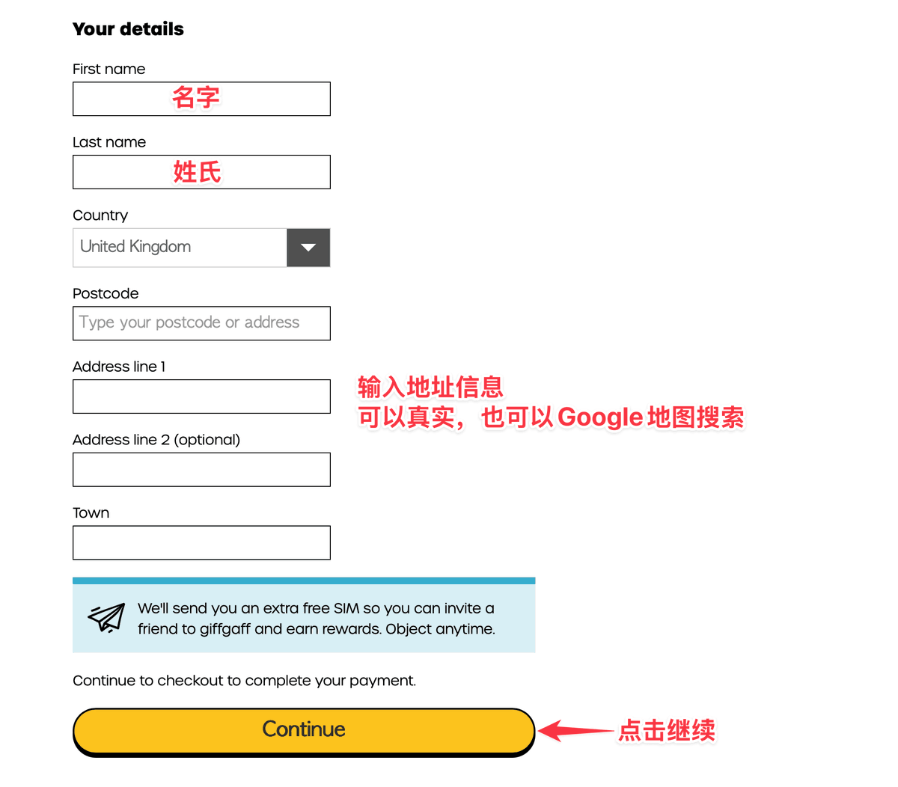

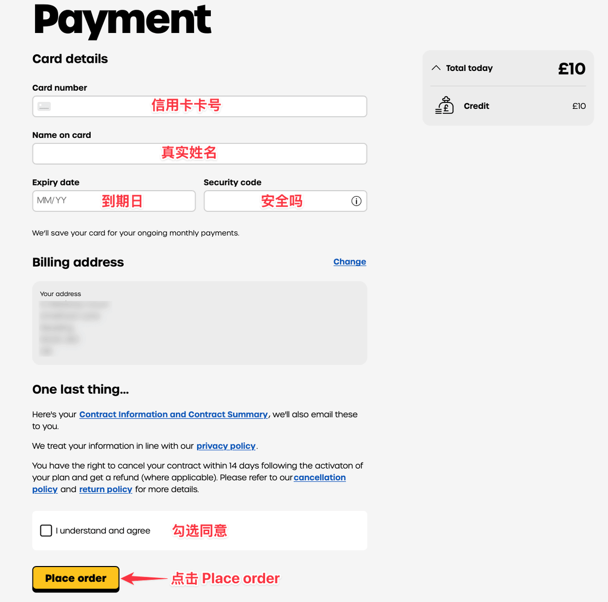

**第九步**：输入信用卡信息，勾选 **I understand and agree**，点击 **Place order**。

:::note
若用充值卡激活，不需要填写信用卡信息。
:::

**第十步**：出现的号码就是你的手机号（英国区号 +44）。

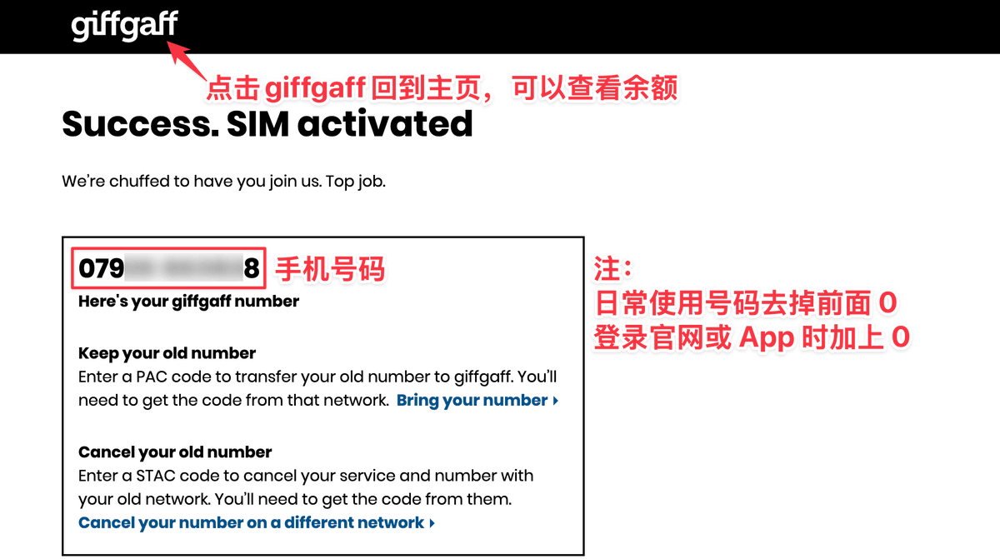

**第十一步**：回到主页，显示余额表示已激活；如果未显示表示还在激活中，请耐心等待。

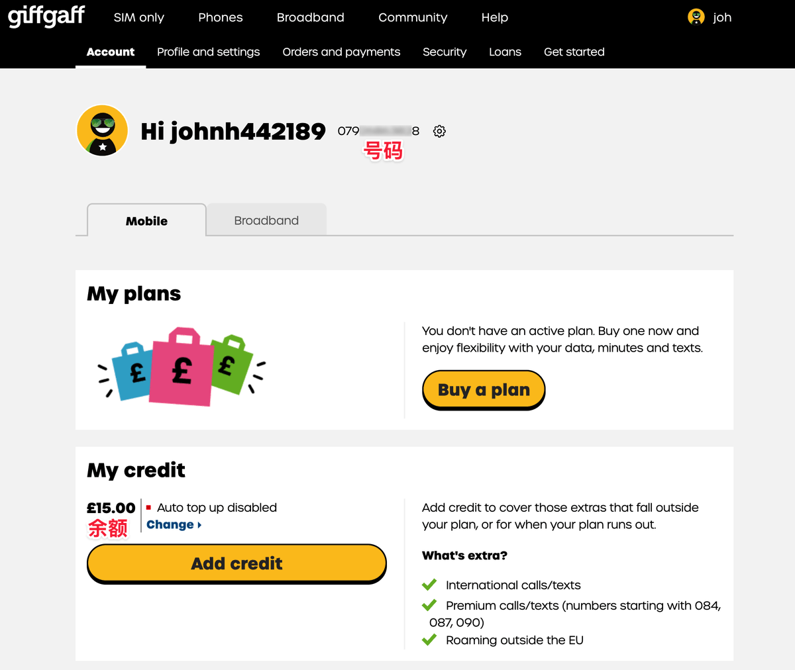

## 02 漫游资费 🌍

在中国大陆等地区使用前，请务必了解漫游资费，避免高额扣费。

- 购买流量套餐：手机端登录 giffgaff App，主页顶部 **My data** 里选择你所在国家（例如中国）进行购买。
- 在其他国家/地区使用资费，可查看[官方漫游页面](https://www.giffgaff.com/roaming)。

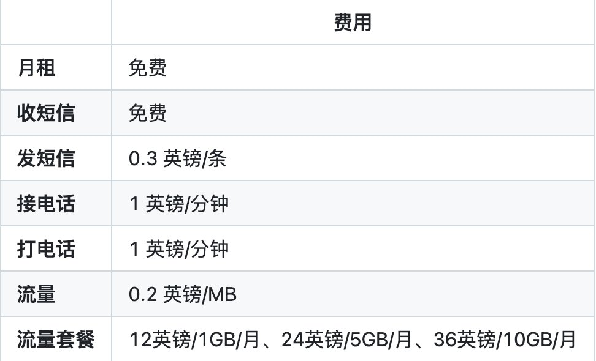

:::warning
这张卡除了收发短信接码之外的其他都不建议使用，因为真的很贵没必要。**强烈建议关闭移动数据与数据漫游！**
:::

## 03 保号规则 🛡️

核心规则 —— 不操作会被回收，请认真阅读。

- 每 **180 天**（6 个月）内必须有一次有效的消费 / 充值产生的余额变动。
- 从充值激活日开始计算，以后每次消费 / 充值产生余额变动的日期，都作为新一轮周期的开始。
- 如果在规定时间内没有任何操作，号码将被回收，余额将作废且无法找回。

保号操作任选其一：

1. 发一条短信（最推荐）。
2. 用一次移动数据上网。
3. 打一次电话（不包括拨打紧急服务和官方客服热线）。
4. 充一次话费。

:::important
建议卡到手后在手机日历里做个提醒，设置为 **175 天**左右比较安全；每次余额变动后记得更新提醒，这样最稳。官方会在保号周期到期前 35 天及 5 天发送 2 份提醒邮件，请特别留意。
:::

## 04 查询本机号码 📞

- 编辑短信内容 `number` 发送到 **2020** 或者 **43430**。
- 通常会在 30 秒到 2 分钟内收到回复短信。

## 05 短信 / 电话格式 ✉️

拨打或发送给英国号码时的正确格式：

- 例如朋友的英国号码是：`88xxxxxx88`。
- 发短信 / 打电话格式：**+ 国家区号 + 号码**，示例 `+4488xxxxxx88`。

## 06 更改密码 / 邮箱 🔑

- **改密码**：前往[密码重置页面](https://www.giffgaff.com/auth/reset-password)。
- **改邮箱**：在[个人资料页面](https://www.giffgaff.com/profile/details)修改邮箱等信息。

## 07 收不到短信 🚫

- 先确定有信号，能收到官方短信即表示号码正常（例如登录官网时收到验证码）。
- 如果在注册平台收不到短信，一般是代理 IP / VPN 问题，请更换更干净的 IP。

## 08 更改号码 🔄

如对系统分配的号码不满意（或该号码有使用记录），可以更换，依旧随机分配。

1. 打开[换号页面](https://www.giffgaff.com/profile/details/getnumber)，点击 **Get a new giffgaff number**。
2. 输入密码，再点击 **Change my number**。
3. 系统会跳转至个人信息与设置界面，等待显示新号码。

:::warning
注意事项：中国时间深夜 5:30 至上午 13:00 期间不可更换；新号码和余额最多需 4 小时显示到账户；全程使用 Wi-Fi；每个账户支持更换 2 次号码，第二次需 24 小时后。
:::

## 09 打电话提示"设置了限制" ⚠️

手机设置里关闭运营商自动选择，手动选择**中国移动**，并重启手机后再发送。

## 10 查询余额 💰

登录[官网](https://www.giffgaff.com)或使用 App 查询。

## 11 充值 💳

1. 登录[官网](https://www.giffgaff.com)，点击 **Add credit**。
2. 选择金额和支付方式，点击 **Continue** 按提示操作。
3. 可用带 VISA 或 MasterCard 标志的信用卡充值。

:::tip
也可通过第三方平台购买 giffgaff Voucher，输入 16 位数字码即可完成充值。
:::

## 12 实体卡转 eSIM 📲

准备：支持 eSIM 的手机（例如外版无锁 iPhone）；手机安装好 giffgaff App 并连接 Wi-Fi；操作时间为**北京时间 12:30 至次日凌晨 4:30**。

1. 登录 App，依次点击 **Account › SIM › Replace my SIM › Switch to a new eSIM**。
2. 会看到提示，请保持稳定的 Wi-Fi 连接。
3. 勾选 **I understand and accept this**，点击 **Start the switch**。
4. 输入短信收到的验证码（或点击将验证码发到邮箱），点击 **Confirm**。
5. 点击 **Install eSIM**，按提示操作，最后出现 *We're activating your eSIM*（我们正在激活您的 eSIM）。
6. 一般 1 小时内会激活好（最慢不超过 24 小时），可不定时打开 App 查看；完成后实体卡自动无服务（即作废）。

:::note
上述步骤官方可能不定时更新，以官网为准。
:::

## 13 eSIM 转实体卡 🔁

操作时间：**北京时间 12:30 至次日凌晨 4:30**。

1. 买一张未激活的 SIM 卡。
2. 网页打开官网，进入[个人资料和设置](https://www.giffgaff.com/profile/details)，找到 **Replace my SIM**，点击 **Activate your SIM**。
3. 输入新卡片上 6 位激活码。
4. 点击 **Yes, I want to replace my SIM**。
5. 再点击 **Yes I'm sure**，等待不到 1 小时（最多 24 小时）即可转好。

## 14 Wi-Fi Calling 📶

开启 Wi-Fi Calling 后资费更便宜：发短信 **0.08 英镑/条**，打电话 **0.03 英镑/分钟**。需在全局英国 IP 网络环境下使用。

1. iPhone 设置 → App → 电话 → 打开 **Wi-Fi 通话**。
2. iPhone 设置 → 蜂窝网络 → 点击你的号码 → 语音与数据 → 选择 **4G 或 5G**。

:::note
官网提供介绍与视频演示，可前往官网查看 Wi-Fi Calling 相关说明。
:::

## 15 其他常见问题 🧩

- **续费充值**：[Top-up](https://www.giffgaff.com/top-up)
- **话费账单查询**：[账单查询](https://www.giffgaff.com/profile/usage-statement)
- **eSIM 相关问题**：[官方 eSIM 帮助合集](https://help.giffgaff.com/en/collections/626993-esim)
- **转入空卡**：[SIM Swap](https://www.giffgaff.com/profile/details#simswap)
- 如果还有其他疑问，建议配合使用 AI 工具提问。

## 16 官方客服 / 条款 📋

- **客服**：[Contact](https://www.giffgaff.com/boiler-plate/contact)
- **条款**：[Terms](https://www.giffgaff.com/terms)
